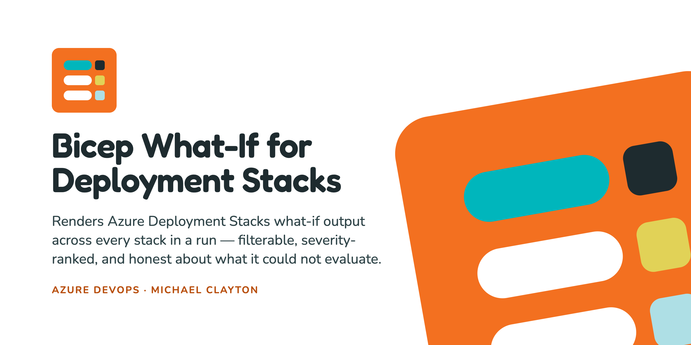

Azure Deployment Stacks report more than a deployment what-if can: alongside
Create and Modify they name the resources a deploy will **Detach** or **Delete**
because they dropped out of the template, and they report each resource's
management and deny status. That output is the most valuable thing a pre-deploy
review has, and it currently arrives as one HTML blob per stack, per stage.

This extension puts every stack in a run on one screen.

## What it adds

**A build results tab.** One row per changed resource across every stack in the
run, ranked by how much it can hurt you rather than grouped by which stack it
came from. Filter by severity, by stack, or by resource type; click a row for its
property-level diff; every filter and selection lives in the URL, so a link picks
out the row you were looking at.

**A pipeline task.** One task, two operations. `whatIf` previews a stack against
what it currently manages and attaches the result; `create` applies it. Both read
the same inputs and take the same code path, so a preview cannot disagree with
the deploy it previews about the unmanage actions or deny settings — a
difference there makes the preview a lie, most obviously about whether a dropped
resource is reported as Detach or as Delete.

## When Microsoft's Bicep Deploy task is enough

Azure Pipelines has a built-in task,
[Bicep Deploy (`BicepDeploy@0`)](https://learn.microsoft.com/azure/devops/pipelines/tasks/reference/bicep-deploy-v0),
that deploys Bicep templates, deployment stacks included. It needs no extension
and Microsoft maintains it. If it covers what you need, use it.

*Compared with `BicepDeploy@0` as Microsoft documented it on 23 September 2026,
and with its source on 6 October 2026. That task changes, so check its current
page before relying on this section.*

**Use `BicepDeploy@0` if you:**

- deploy ordinary deployments rather than stacks. It can preview those with
  what-if too.
- deploy stacks and do not need to preview the change first.
- deploy at tenant scope. Deployment stacks do not exist there, so this
  extension's task covers resource group, subscription and management group
  scope only.
- need template outputs as pipeline variables, inline parameter overrides, stack
  tags or masked outputs. This extension's task has none of these.
- run classic release pipelines. This extension's tab is a build results tab, so
  a release has nowhere to show it.

**What this extension adds:**

- **A page to read the result on.** One tab for every stack in a run: filterable,
  sortable, ranked by severity, with any stage that produced nothing shown as
  not evaluated rather than as unchanged. `BicepDeploy@0` reports to the build
  log only, and a built-in task cannot add a page to the build results.
- **What-if for deployment stacks.** `BicepDeploy@0` can create, validate and
  delete a stack, but not preview one. A stack what-if is what reports the
  resources a deploy would Detach or Delete because they dropped out of the
  template. Microsoft has this in progress: an open pull request to the library
  `BicepDeploy@0` is built on,
  [Azure/bicep-deploy#327](https://github.com/Azure/bicep-deploy/pull/327),
  adds stack what-if as text in the build log. Expect this difference to close.
- **Preview and deploy from one set of inputs.** This is an alternative to
  deploying with `BicepDeploy@0`, not something to add on top of it: previewing
  here and deploying there means keeping two tasks' inputs in step by hand.

## The thing it refuses to do

**Absence of data never renders as absence of change.**

What-if stages usually run with `continueOnError`, so a stage that fails attaches
nothing at all. A tab that rendered only the attachments it received would show
eight clean stacks as a safe deploy while the ninth was never evaluated. So the
tab reconciles against the build timeline rather than the attachment list: every
what-if stage in the run gets a row, and a stage that produced nothing is ranked
`unevaluated` — above `noChange`, so the default filter cannot bury it — with a
banner that does not dismiss.

The task holds up its end: it writes its sidecar manifest on failure as well as
on success, because "evaluated, found nothing" and "never evaluated" have to be
different on the wire.

## Severity is the maximum across four axes

A resource can lose protection with no property change and no interesting change
type. A `noChange` resource whose management status moves from `managed` to
`notManaged` is the stack quietly stopping to govern a key vault, and sorting on
change type puts it at the bottom of the table next to two hundred benign no-ops.

| | Rung | Reached by |
|---|---|---|
| `-` | destructive | `delete` |
| `/` | protectionLoss | `detach`, management lost, deny settings weakened |
| `+` | create | `create` |
| `~` | modify | `modify` |
| `?` | unevaluated | `unsupported`, an unrecognised change type, or a stage that attached nothing |
| `*` | noChange | `noChange` |

## Permissions

`vso.build` — build read — and nothing else. No `build_execute`, no `code`, no
`serviceendpoint`. The tab is a static page: everything it shows comes from build
attachments produced by the task, and it makes no request to any host outside
Azure DevOps. No CDN, no font host, no telemetry.

The task talks to Azure Resource Manager using the service connection you give
it, and downloads a version-pinned Bicep compiler from `github.com/Azure/bicep`
at run time. Pinning is deliberate: compiler output changes across versions, and
every consumer's what-if should compile identically.

## Getting started

```yaml
- task: StackWhatIf@1
  displayName: What-If — network
  continueOnError: true
  inputs:
    operation: whatIf
    azureResourceManagerConnection: 'My ARM Connection'
    stackId: network
    stackName: app-network
    templateFile: stacks/01-network-stack.bicep
    parametersFile: params/network.bicepparam
    location: CentralUS
    actionOnUnmanageResources: detach
    actionOnUnmanageResourceGroups: detach
    denySettingsMode: none
```

Name the stage `WhatIf_<Something>` and repeat the step per stack, one stage
each. Full documentation, including why the fan-out belongs in your YAML rather
than inside the task, is in the
[repository](https://github.com/mfclay/azure-devops-extensions/tree/main/bicep-whatif).

## What-if is a prediction, not a promise

It carries documented accuracy limits and stack what-if inherits every one of
them. The Detach and Delete rows are simultaneously the most valuable output here
and the ones to check hardest. This tool exists to make them easier to *read* —
it is not a reason to trust them without looking.
