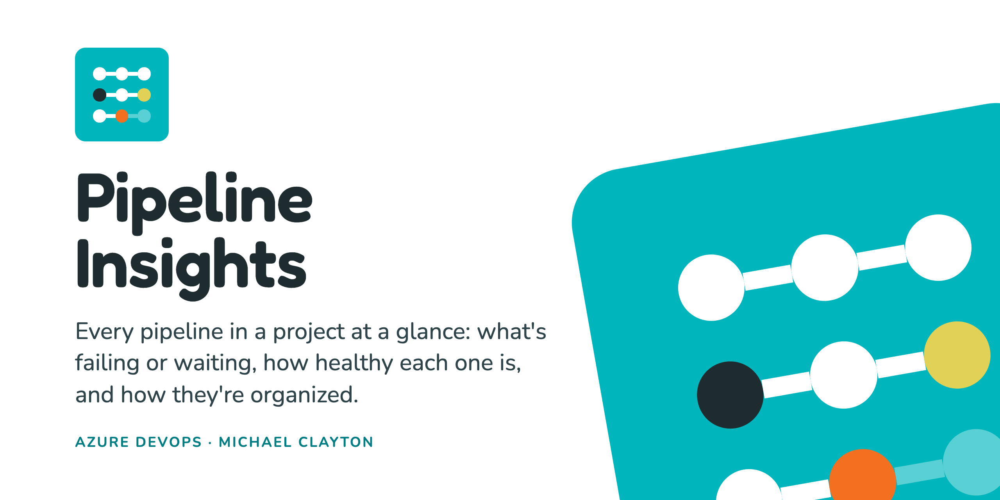
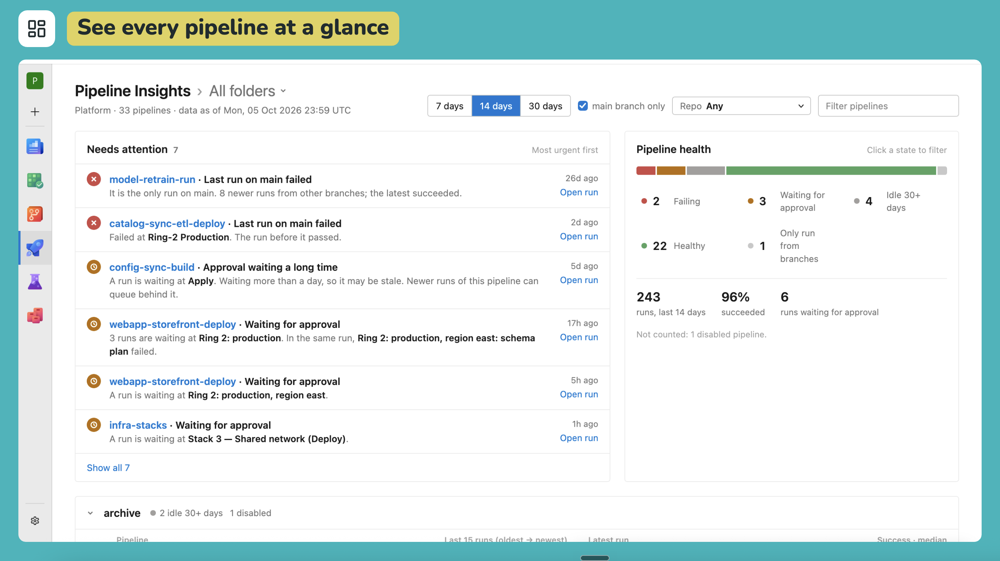
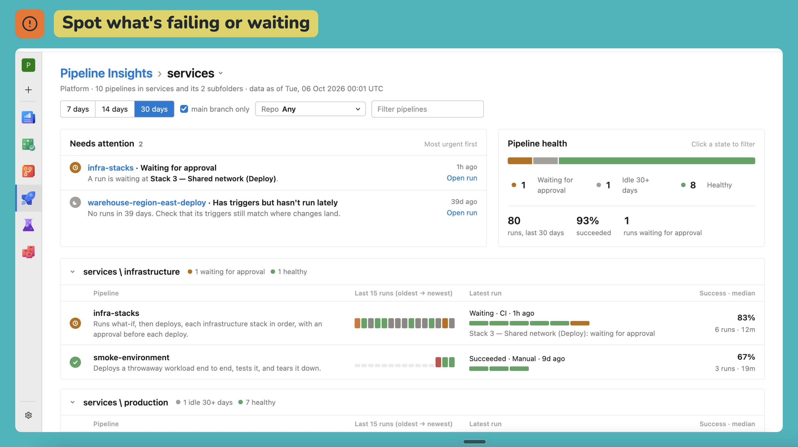
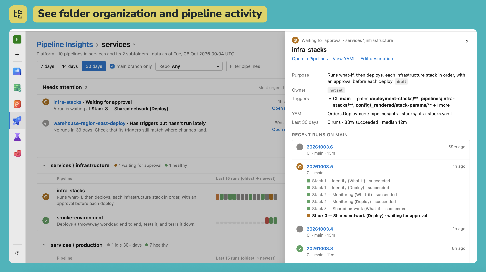
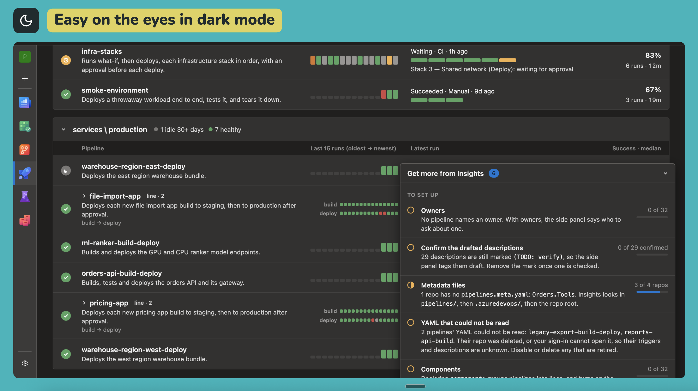

One page in the Pipelines menu that shows a project's pipelines at a glance.



- **Needs attention:** failing pipelines, runs waiting at an approval, and pipelines that have
  gone quiet, most urgent first.
- **Pipeline health:** every pipeline by state, with run counts and success rates for the last 7,
  14 or 30 days.
- **Folders:** one block per pipeline folder, with each pipeline's recent runs, and a side panel
  with its stages and history. Pick a folder from the heading to see only that folder and its
  subfolders.
- **Get more from Insights:** a panel at the bottom of the page that says what your pipelines'
  descriptions are still missing and what each would unlock.





The page follows your Azure DevOps theme, light or dark, and switches with it without a reload.



The page reads Azure DevOps with your own sign-in, so you see only the pipelines you can already
open. Nothing is stored outside Azure DevOps; your browser only remembers whether you left the
setup panel open, and whether you asked it to search whole repos.

## Describing a pipeline

Insights reads each pipeline's purpose, owner, category and component from one file per repo,
`pipelines.meta.yaml`, on the default branch. Each entry is keyed by the pipeline's YAML path
from the repo root.

```yaml
pipelines:
  pipelines/app-build.yaml:
    owner: Platform Team
    category: production
    component: web-app
    purpose: >-
      Builds and pushes the web app image. Its completion triggers
      app-deploy.
    details: |
      ## When it fails

      Re-run it once; a second failure is real.
```

- Insights looks for the file in `pipelines/`, then `.azuredevops/`, then the repo root, and
  uses the first it finds. The setup panel has a box to search a whole repo instead; it is off
  by default, because it lists every file in the repo.
- `purpose` and `owner` are expected. A purpose ending `(TODO: verify)` is shown as a draft.
  Write the purpose as a folded block (`>-`), as above: a plain YAML value cannot contain `: `,
  and the draft mark does.
- `category` is a short slug. Once any pipeline declares one, a Category filter appears.
- `component` names the thing a pipeline ships. Pipelines that declare the same component are
  shown together as one line; set it where triggers and names cannot show the link.
- `details` is Markdown, such as a runbook, shown in the side panel.
- The setup panel lists repos with no file, problems in a file, and entries whose YAML path no
  pipeline uses. Rename an entry in the same pull request as its YAML.
